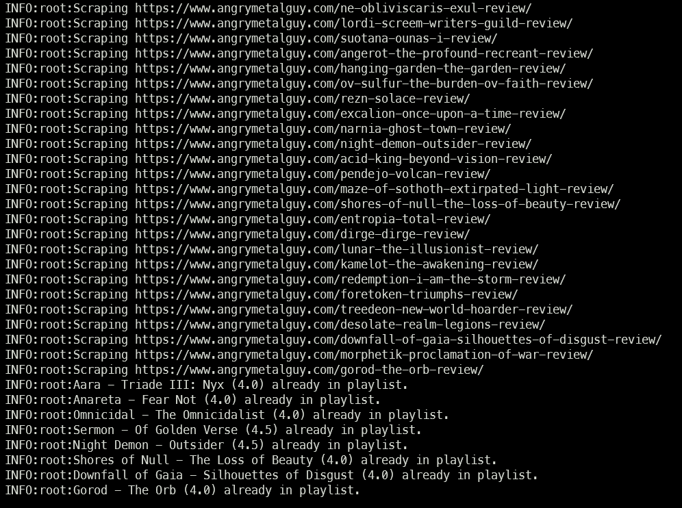
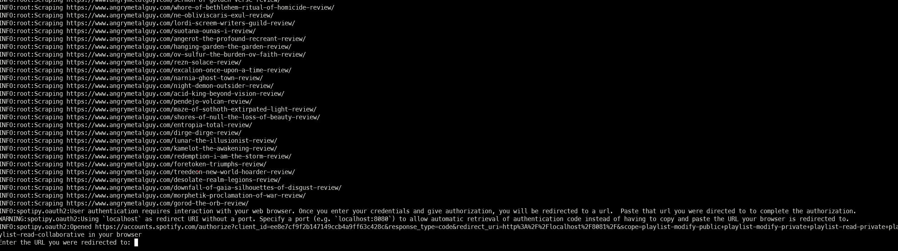

# Angry Metal Guy to Spotify

I've been reading the [Angry Metal Guy](https://www.angrymetalguy.com/) website (AMG) for many years. They do _lots_ of metal album reviews and over the years I've discovered many awesome bands though their work.

Unfortunately, these days I simply don't have to time to read/listen to every single band featured on the website... so I built this small project to scrape reviews and add the albums to my spotify playlist.

The [playlist](https://open.spotify.com/playlist/52a8LeWcFcYtHhGMHJooHN?si=ccc94e86a9e049f3) is open to public, so feel free to follow if you don't wanna deal with all the tech stuff. Beware that I might remove any of the albums that I've already listened/disliked at will (note that the app can add to both public and private playlists, no restrictions).

## Setup

Before we get into specifics, here's an overview of some of the tools that are used by this project:

- You'll need [poetry](https://python-poetry.org/) for dependency management.
- `make venv` to create a local environment.
    - This requires `poetry` for dep management. I recommend installing `poetry` using [pipx](https://www.youtube.com/watch?v=FyA4i_dP934).
    - If you don't use [virtualenv](https://virtualenv.pypa.io/en/latest/), create the python environment using whatever you like.
        - Note you'll still have to run `poetry install` inside the enviroment.
- All credentials and configs are read from env vars. Use `make .env` to create a local `.env` file with the variables you need. Fill out with your own information / configs.

### Spotipy Setup

Anything spotify-related is done using a python package called [spotipy](https://github.com/spotipy-dev/spotipy). Since this is not a project with a UI, there's a slightly annoying process you'll have to go through when running for the first time:

- Go to https://developer.spotify.com/ and register a new app. Add the following to your local `.env`:
    - `SPOTIFY_CLIENT_ID`: app client id
    - `SPOTIFY_CLIENT_SECRET`: app client secret
    - `SPOTIFY_USERNAME`: your spotify username
    - `SPOTIFY_REDIRECT_URI`: a redirect URL for the auth process. Since this is backend, I recommend something simple like http://localhost/8081/

When you do `python run.py` for the first time, spotipy will give you a link in your terminal:

Click on that link, authenticate to Spotify in your browser and paste the redirect link back into your terminal (the link should start with the dummy `SPOTIFY_REDIRECT_URI` you've used, i.e. http://localhost/8081). This will create a local `.cache-<spotify-username>` file in the app directory (the file is .gitignored).

Now all is left is to find your target playlist id (`SPOTIFY_PLAYLIST_ID`). To do this:
- Right-Click the playlist in spotify and choose _Share_ -> _Copy link to playlist_.
- The highlighted portion of the link is the playlist id: https://open.spotify.com/playlist/**52a8LeWcFcYtHhGMHJooHN**?si=9c4eea62db564db7

### Configuration

You can change the behavior of this app by changing the following inside `.env`:

- `SCORE_CUTOFF`: Only scores equal or above this number will be added. AMG reviews go from 0.0 to 5.0 - the value should be a float.
- `NUMBER_OF_PAGES`: Number of pages to scrape each time. I leave this at 3 for weekly runs, but you go as far as you want.
- `SUPRESS_SCRAPING_ERRORS`: Only relevant if deploying to lambdas (if fails _even_ if all you're doing is logging an exception). Leave as `False` for local runs.

## Deployment

I use a combo of AWS Lambda and Amazon EventBrige to run this app on a schedule. To simplify the deployment process, I've added a `make lambda-deploy` command that creates a `zip` file with the code and all dependencies, then uploads to your lambda using the [aws](https://aws.amazon.com/cli/) cli.

Add the values you have in your local `.env` file as Environment Variables in the lambda configuration.

Note that you **must** have a local `.cache-*` file created before uploading this to lambda, otherwise spotipy _won't_ work. I'd rather have this as an env vars or something, but couldn't find any alternatives. It's a compromise, but this file only holds a temporary key that expires very quickly, refreshing every new time you try to access by using your ClientID + ClientSecret. The scope of the access is also decrease as much as possible (can only modify playlists and nothing else).

EventBridge should be easy to configure once you have your lambda up. Just go to _Schedules_ and add a new Cron Expression, using your lambda as the target.

## About "Scores"

I know there's a lot of controversy about "scores" on a website not being the best indicator of the quality of an album. However, if any of the reviewers in AMG give a album 3.5+, I know I'll at least _try_ to listen to that release. So I see this app more of an "automation for stuff I know I was going to listen anyway" vs. "list of THE best releases of the week".

I made sure to make this as configurable as possible - you can decrease the score cutoff to whatever you like, even potentially creating an instance that adds _everything_ that gets reviewed to a playlist (though you might have issues with the format of the posts changing over the years).

## TODOs

- Hook this up to github actions for linting / testing
- Deploy to lambda when a PR is merged to `main`
